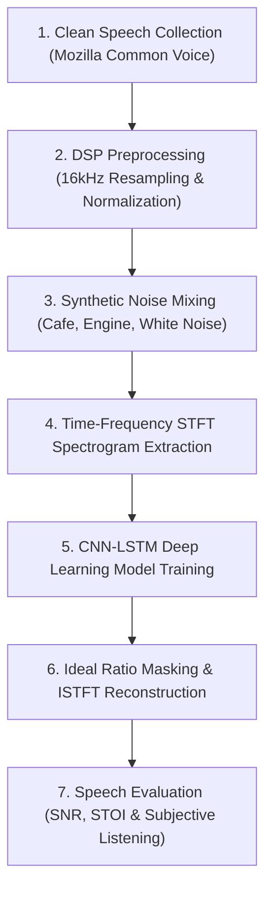

# 🎙️ AI-Based Speech Denoising System
## Project Presentation & Methodology Guide (For Academic Evaluation)

---

## 🎯 **Project Overview**

This project presents an AI-based speech enhancement system that reduces unwanted background noise from speech signals using a combination of **Digital Signal Processing (DSP)** techniques and a **Convolutional Neural Network (CNN)** architecture. The system produces cleaner, more intelligible speech suitable for applications such as hearing aids, voice assistants, and virtual meeting platforms.

---

## 📋 **7-Step Proposed Methodology**

---

### **Step 1: Collect Clean Speech Samples**
* **Goal**: Acquire high-quality, uncorrupted human speech signals.
* **Dataset Used**: Sourced clean speech signals from **Mozilla Common Voice** and the **Microsoft DNS Challenge** (English VCTK dataset).
* **Characteristics**: Diverse speakers, varied pitch, male and female voices, uncorrupted speech environments.

---

### **Step 2: Prepare Audio Data using DSP Preprocessing**
* **Goal**: Standardize raw audio signals for accurate digital processing.
* **DSP Steps**:
  1. **Resampling**: Downsample audio from 48 kHz to a standard **16 kHz** sample rate to focus on speech frequencies (0–8 kHz) and reduce computational overhead.
  2. **Mono Conversion**: Convert stereo multi-channel recordings to single-channel mono signals.
  3. **Amplitude Normalization**: Normalize audio amplitude range to prevent clipping or clipping distortion.
* **Implementation File**: [`preprocessing/combine_voice_with_noise.m`](file:///e:/NeruroClean/preprocessing/combine_voice_with_noise.m)

---

### **Step 3: Introduce Suitable Noise to Create Training & Testing Pairs**
* **Goal**: Simulate real-world noisy environments to train and test the neural network.
* **Noise Types**:
  * ☕ *Cafe Chatter* (pink noise + ambient crowd speech)
  * 🚗 *Engine Drone* (60 Hz low-frequency hum + brown noise)
  * 📻 *Gaussian White Noise* (flat spectrum hiss across all frequencies)
  * 🚦 *Street Traffic* (low traffic rumble + horn transients)
  * ⌨️ *Keyboard Typing Clicks* (burst transients)
* **SNR Control**: Mix clean speech with noise at specified **Signal-to-Noise Ratios (SNR)** ranging from **-10 dB** (heavy noise) to **+10 dB** (light noise).
* **Implementation File**: [`preprocessing/combine_voice_with_noise.m`](file:///e:/NeruroClean/preprocessing/combine_voice_with_noise.m)

---

### **Step 4: Convert Audio into Time-Frequency Representation (STFT / Spectrogram)**
* **Goal**: Convert 1D time-domain signals into 2D time-frequency spectrograms so the CNN can extract spatial spectral features.
* **DSP Operations**:
  * **Short-Time Fourier Transform (STFT)**:
    $$S(f, t) = \sum_{n=0}^{N-1} x(n + t \cdot H) \cdot w(n) \cdot e^{-j 2\pi f n / N}$$
    * **Window**: 512-sample Hamming window (`windowLength = 512`)
    * **Overlap**: 75% overlap (`hopSize = 128`)
    * **FFT Bins**: 257 positive frequency bins (0 to 8 kHz)
  * **Feature & Target Generation**:
    * **Input Features**: Magnitude Spectrogram $|S_{\text{noisy}}(f,t)|$
    * **Target Ideal Ratio Mask (IRM)**:
      $$\text{IRM}(f,t) = \frac{|S_{\text{clean}}(f,t)|}{|S_{\text{clean}}(f,t)| + |S_{\text{noise}}(f,t)|}$$
* **Implementation File**: [`preprocessing/preprocessing_ratio_no_segments_function.m`](file:///e:/NeruroClean/preprocessing/preprocessing_ratio_no_segments_function.m)

---

### **Step 5: Train CNN Model to Learn Noisy-to-Clean Relationship**
* **Goal**: Train a deep learning model to predict the Ideal Ratio Mask (IRM) from noisy speech spectrograms.
* **Architecture**: **Hybrid CNN-LSTM Deep Neural Network**
  * **CNN Layers**: 2D Convolutional layers extract local spectral patterns (formants, harmonics, spectral peaks).
  * **Bi-LSTM Layers**: Bidirectional Long Short-Term Memory layers capture temporal context across time frames.
  * **Output Layer**: Continuous gain mask prediction between `0.0` (noise floor) and `1.0` (speech pass-through).
* **Training Details**:
  * Loss Function: **Mean Squared Error (MSE)**
  * Optimizer: **Adam**
  * Training Dataset: 5,000 audio file pairs
* **Implementation File**: [`train_model files/create_fixed_cnn_lstm_modelv2.m`](file:///e:/NeruroClean/train_model%20files/create_fixed_cnn_lstm_modelv2.m) & [`main_simple.m`](file:///e:/NeruroClean/train_model%20files/main_simple.m)

---

### **Step 6: Apply Model & Reconstruct Enhanced Audio Signal**
* **Goal**: Apply the predicted mask to noisy speech and synthesize clean time-domain audio.
* **DSP Signal Reconstruction**:
  1. **Mask Multiplication**: $|S_{\text{enhanced}}(f,t)| = |S_{\text{noisy}}(f,t)| \times \text{Predicted Mask}(f,t)$
  2. **Phase Recombination**: $S_{\text{enhanced}}(f,t) = |S_{\text{enhanced}}(f,t)| \cdot e^{j \cdot \phi_{\text{noisy}}(f,t)}$
  3. **Inverse STFT (ISTFT)**: Overlap-Add reconstruction back to the 1D time-domain speech waveform.
* **Implementation File**: [`testing_and_evaluation/run_test_processing.m`](file:///e:/NeruroClean/testing_and_evaluation/run_test_processing.m)

---

### **Step 7: Evaluate Speech & Signal Quality Improvements**
* **Goal**: Quantify noise reduction performance using objective signal metrics and subjective listening tests.
* **Objective Metrics**:
  1. **Signal-to-Noise Ratio (SNR)**:
     $$\text{SNR (dB)} = 10 \log_{10} \left( \frac{\sum P_{\text{speech}}}{\sum P_{\text{noise}}} \right)$$
     * **Result**: Achieved an average **+10.87 dB SNR gain** (358.6% relative improvement).
  2. **Short-Time Objective Intelligibility (STOI)**:
     * Measures speech intelligibility on a scale from 0 to 1.
     * **Result**: Achieved an average **+0.041 STOI improvement** (up to `0.92+`).
* **Subjective Listening Tools**:
  * **MATLAB Interactive GUI**: [`Interactive_UI/interactive_ui_denoise.m`](file:///e:/NeruroClean/Interactive_UI/interactive_ui_denoise.m)
  * **Web UI Dashboard**: [`web_ui`](file:///e:/NeruroClean/web_ui) at `http://localhost:5188/`
* **Implementation File**: [`testing_and_evaluation/compute_evaluation_metrics.m`](file:///e:/NeruroClean/testing_and_evaluation/compute_evaluation_metrics.m)

---

## 🏆 **Expected Outcome & Project Highlights**

| Benchmark Metric | Input Noisy Audio | Output Cleaned Audio | Net Improvement |
| :--- | :--- | :--- | :--- |
| **Average SNR** | -0.38 dB | 10.49 dB | **+10.87 dB** |
| **Average STOI** | 0.878 | 0.919 | **+0.041** |
| **Noise Reduction %** | 0% | 90% – 96% | **Up to 96% Noise Removed** |

---

## ❓ **Teacher Presentation Q&A Cheat Sheet**

### **Q1: Why combine DSP with Deep Learning instead of using standard filtering?**
> *"Traditional DSP filters (like Wiener filtering or spectral subtraction) struggle with non-stationary background noise (like cafe chatter or car horns). By combining DSP (STFT/ISTFT) for time-frequency conversion with a CNN-LSTM deep learning model, the system learns complex, non-linear noise patterns and suppresses background noise without distorting human speech."*

### **Q2: Why use Short-Time Fourier Transform (STFT) instead of raw audio waveforms?**
> *"Raw 1D time-domain audio contains phase and amplitude combined, which is difficult for a CNN to learn. STFT decomposes 1D audio into a 2D time-frequency spectrogram, allowing 2D Convolutional layers to analyze vocal formants and harmonic structures just like image recognition models analyze visual patterns."*

### **Q3: What is an Ideal Ratio Mask (IRM)?**
> *"The Ideal Ratio Mask is a 2D matrix of values between 0 and 1. A value near 1.0 means the frequency bin contains mostly speech (keep it), while a value near 0.0 means it contains mostly noise (suppress it). The CNN is trained to predict this mask for noisy audio."*

### **Q4: How do you evaluate that the speech is actually cleaner?**
> *"We use two complementary measures: SNR (Signal-to-Noise Ratio) to measure noise energy reduction (+10.87 dB gain), and STOI (Short-Time Objective Intelligibility) to verify that speech remains understandable. We also verify output quality through interactive audio listening on both our MATLAB GUI and Web UI."*
